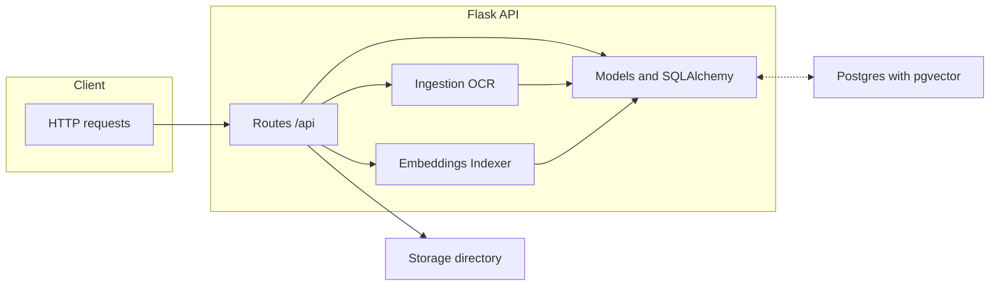

<div align="center">
  
</div>

<h3 align="center">
  <em>A minimal, container-ready document API with optional OCR + embeddings</em>
</h3>

<div align="center">
  
  
  
  
  
  
</div>

<br />

## ✨ What Is This?
Knowledge Hub is a lightweight document management and ingestion service built with Flask, SQLAlchemy, and Postgres+pgvector. It exposes simple endpoints to upload, list, and manage documents — with optional OCR to turn PDFs/images into searchable text chunks and an optional embeddings indexer to vectorize content for similarity search.

<div align="center">
  <sub>Quick links</sub><br />
  <a href="#-quick-start">Quick Start</a> •
  <a href="#-api">API</a> •
  <a href="#-tech-stack">Tech Stack</a> •
  <a href="#-ingestion-ocr-optional">OCR</a> •
  <a href="#-embeddings-optional">Embeddings</a> •
  <a href="#-development">Dev</a>
</div>

---

## 🚀 Quick Start
Prereqs: Docker + Docker Compose

```bash
# Build and launch database + API
docker compose up --build

# API base URL
open http://localhost:8000

# Health checks
curl http://localhost:8000/health
curl http://localhost:8000/api/ping
```

Data lives under `./data/postgres`, and uploads under `./storage`. Tweak `compose.yaml` to your needs.

Optional: enable local LLM with Ollama

```bash
# Start Ollama on your host machine
ollama serve

# Pull the model used by the Answer API
ollama pull llama3.2:latest
```

When running the API in Docker, the container reaches your host’s Ollama via `http://host.docker.internal:11434` (preconfigured in `.env` and `compose.yaml`). If you run the API locally (no Docker), use `http://localhost:11434` instead.

---

## 🔌 API
Base: `http://localhost:8000/api`

- `GET /ping` — simple OK check
- `GET /documents` — list latest 50 documents
- `POST /documents` — create by title (JSON)
- `POST /documents/upload` — multipart file upload (with optional `title`)

Search

- `POST /search` — full‑text search over chunks (Postgres FTS)
- `POST /search/semantic` — vector search (pgvector, cosine distance)
- `POST /search/hybrid` — blended semantic + FTS with OCR‑confidence weighting

Answer (RAG)

- `POST /answer` — runs hybrid retrieval, packs grounded context, calls your local Ollama model, returns an answer with citations

Examples

```bash
# List documents
curl http://localhost:8000/api/documents

# Create by title
curl -X POST http://localhost:8000/api/documents \
  -H 'Content-Type: application/json' \
  -d '{"title": "My Note"}'

# Upload a PDF
curl -X POST http://localhost:8000/api/documents/upload \
  -F "file=@/path/to/file.pdf" \
  -F "title=Project Plan"
```

Search (hybrid) example

```bash
curl -s http://localhost:8000/api/search/hybrid \
  -H 'Content-Type: application/json' \
  -d '{"q":"stable matching proof","limit":12,"document_id":6}' | jq .
```

Answer example

```bash
curl -s http://localhost:8000/api/answer \
  -H 'Content-Type: application/json' \
  -d '{
        "q": "Prove correctness of Gale–Shapley.",
        "filters": {"document_id": 6},
        "k": 16,
        "max_context_tokens": 3000
      }' | jq .
```

---

## 🧱 Architecture


---

## 🧰 Tech Stack
<div align="center">
  
  <br />
  <sub>Plus: SQLAlchemy, Gunicorn, pgvector, Pydantic Settings</sub>
  <br />
  <sub>OCR (optional): OpenCV, PyMuPDF, Tesseract, NumPy</sub>
  <br />
  <sub>Embeddings (optional): Sentence-Transformers, NumPy, PyTorch (CPU)</sub>
  <br />
  <sub>LLM (optional): Ollama (local), llama3.2:latest</sub>
  <br /><br />
</div>

Project layout

```
apps/server/
  app/
    __init__.py     # Flask app factory
    config.py       # Pydantic-based settings
    db.py           # SQLAlchemy instance
    models.py       # ORM models
    ingestion.py    # OCR ingestion utilities (optional)
    api/
      __init__.py   # API blueprint
      routes.py     # Endpoints
  Dockerfile        # API container image

compose.yaml        # Compose stack (db + api)
.env                # Local environment config
```

---

## 🧪 Configuration
Values are pulled from env and `.env` via Pydantic (see `apps/server/app/config.py`).

- `DATABASE_URL` — SQLAlchemy DSN used by the API
- `SECRET_KEY` — Flask secret for signing
- `STORAGE_DIR` — upload directory (default `/app/storage`)
- `MAX_CONTENT_LENGTH` — upload size cap (1 GiB default)
 - `EMBEDDINGS_BATCH_SIZE` — batch size for embedding jobs (default 128)
 - `OLLAMA_HOST` — Ollama base URL. In Docker: `http://host.docker.internal:11434`; local: `http://localhost:11434`
 - `LLM_MODEL` — model to use (default `llama3.2:latest`)
 - `LLM_TIMEOUT_MS` — LLM request timeout (default 120000)

---

## 🔎 Ingestion (OCR) — Optional
`apps/server/app/ingestion.py` can OCR PDFs/images into text chunks and store them as `Chunk` rows.

You’ll need extra deps to enable OCR:

Python packages

```text
opencv-python
pytesseract
PyMuPDF
numpy
```

System packages (inside Docker)

```dockerfile
RUN apt-get update && apt-get install -y \
    tesseract-ocr \
    libgl1 \
 && rm -rf /var/lib/apt/lists/*
```

Note: OCR increases image size; keep it separate if you don’t need it in prod.

---

## ♻️ Recent Upgrades
- Text-first PDF extraction: extracts embedded text and OCRs only pages that lack it (faster, cleaner for books).
- Confidence-aware ranking: hybrid search slightly down-weights low `ocr_conf` chunks and annotates low confidence in results.
- Smarter chunking: 300–700 token chunks with small overlaps; preserves detected headings in chunk metadata.
- Embeddings hygiene: new/changed chunks are auto-indexed after ingest; IVFFlat index present; runs `ANALYZE` after big ingests. Batch size configurable via `EMBEDDINGS_BATCH_SIZE`.
 - Answer API: `/api/answer` integrates hybrid retrieval with an Ollama-hosted LLM to produce grounded answers with `[CIT-#]` citations, plus timings and debug metadata.

---

## 🧭 Embeddings — Optional
`apps/server/app/embeddings.py` provides helpers to embed text with Sentence-Transformers (default model: `all-MiniLM-L6-v2`). `apps/server/app/jobs.py` includes a batch indexer that finds chunks without embeddings and writes vectors to the `embeddings` table (pgvector column).

Packages to add (not included by default):

```text
sentence-transformers
numpy
# Torch is pulled automatically by sentence-transformers; you can pin a CPU build if needed
```

Run indexing inside the API container:

```bash
# After adding packages to apps/server/requirements.txt and rebuilding the image
docker compose exec kh_api python - <<'PY'
from app import create_app
from app.jobs import index_embeddings
app = create_app()
with app.app_context():
    # Index all chunks without embeddings (first run will download the model)
    print(index_embeddings())
PY
```

Notes
- First run downloads the Sentence-Transformers model into the container cache.
- You can target a single document: `index_embeddings(document_id=123)`.

---

## 🤖 LLM Integration (Ollama)

The Answer API calls your local Ollama server.

- Ensure Ollama is running on your host: `ollama serve`
- Pull the model: `ollama pull llama3.2:latest`
- Docker connectivity: the API container reaches Ollama via `http://host.docker.internal:11434` (set in `.env` and `compose.yaml`).

Troubleshooting

- Error: `httpx.ConnectError: [Errno 111] Connection refused`
  - Verify Ollama is running and listening on port 11434 on the host.
  - From the API container: `docker exec -it kh_api curl -s http://host.docker.internal:11434/api/tags`
  - If running API locally (no Docker), set `OLLAMA_HOST=http://localhost:11434`.

Notes

- Current implementation uses non-streaming chat for simplicity; streaming can be enabled later.
- If the model returns no citations, the server re-prompts once with stricter instructions to include `[CIT-#]`.


## 🛠 Development
Local (without Docker): Python 3.11 + Postgres 16 (with pgvector)

```bash
python -m venv .venv
source .venv/bin/activate
pip install -r apps/server/requirements.txt

export FLASK_APP=app:create_app
cd apps/server
gunicorn -b 127.0.0.1:8000 app:create_app()
```

If you also want the Answer API locally (no Docker), export `OLLAMA_HOST=http://localhost:11434` and start `ollama serve`.

---

## ✅ Production Notes
- Strong `SECRET_KEY` and managed secrets
- Reverse proxy (e.g., Nginx) in front of Gunicorn
- Logging/metrics/health for your orchestrator
- Schema migrations with Alembic as you evolve
- Add real authn/z (defaults use a single dev user)

<div align="center">
  <br />
  
</div>

---

